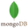

  

  
  
  
  

<h1 align="center">
  Hello There Adventurer, Sayak Raha here
  
</h1>

 I am a Software and Web developer from India. I'm very passionate about Full-Stack Web Development :bar_chart:, love exploring AI and ML concepts,  currently pursuing my B.Tech degree in CSE-IoT from University of Engineering & Management, Kolkata. 

<ul>
<li> Visit my very own website: <a href="https://myself-sayak-raha.netlify.app/" target="_blank">
    https://myself-sayak-raha.netlify.app/
  </a> </li>
  <li> 💬 Let's Discuss about Full Stack Web Development | JavaScript | Node.js | Firebase | MERN | Data Structures | Algorithms </li>
  <li>💼 Chat with me: <a href="https://wa.me/919007382357" target="_blank">click here</a></li>
  <li>👯 I’m looking to collaborate Full Stack Web development Projects </li>
</ul>

<table style="width: 100%; border: none;" align="center">
  <h2 align="center"> Work Experience </h2>
  <tr>
    <th> 💼 Designation </th>
    <th> 🏢 Organization </th>
    <th> ⏰ Timeline </th>
  </tr>
  <tr>
    <td> Fullstack Development Intern </td>
    <td> IEMA Research & Development Pvt. Ltd. - IEMLabs </td>
    <td> January 2023 - Present </td>
  </tr>
  <tr>
    <td> Technical Instructor </td>
    <td> IEMA Research & Development Pvt. Ltd. - IEMLabs </td>
    <td> January 2023 - Present </td>
  </tr>
  <tr>
    <td> Web Development Intern </td>
    <td> Fantastiqo Pvt. Ltd. </td>
    <td> november 2022 - February 2023 </td>
  </tr>
</table>

## Technical Skills

### Languages:

    &nbsp;&nbsp;
    &nbsp;&nbsp;
    &nbsp;&nbsp;
    &nbsp;&nbsp;
    &nbsp;&nbsp;

### Frontend Development:

    &nbsp;&nbsp;
    &nbsp;&nbsp;
    &nbsp;&nbsp;
    &nbsp;&nbsp;
    &nbsp;&nbsp;
    &nbsp;&nbsp;
    &nbsp;&nbsp;
    &nbsp;&nbsp;
    &nbsp;&nbsp;

### Backend Development:

    &nbsp;&nbsp;
    &nbsp;&nbsp;
    &nbsp;&nbsp;
    &nbsp;&nbsp;
    &nbsp;&nbsp;
    &nbsp;&nbsp;

### Database Management:

    &nbsp;&nbsp;
    &nbsp;&nbsp;
    &nbsp;&nbsp;

### Operating Systems:

    &nbsp;&nbsp;
    &nbsp;&nbsp;

### Others:

    &nbsp;&nbsp;
    &nbsp;&nbsp;
    &nbsp;&nbsp;
    &nbsp;&nbsp;
    &nbsp;&nbsp;

## 🏆 Github Profile Trophy

## Profile Statistics

<table>
  <tr>
    <td>
      
    </td>
    <td rowspan="2">
      
    </td>
  </tr>
  <tr>
    <td>
      
    </td>
  </tr>
</table>
